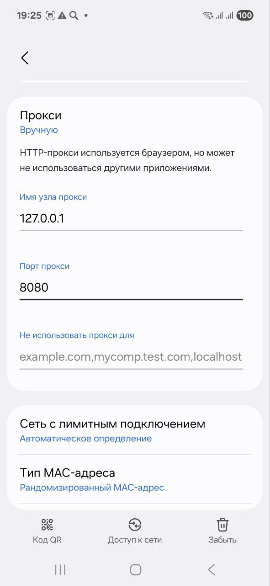
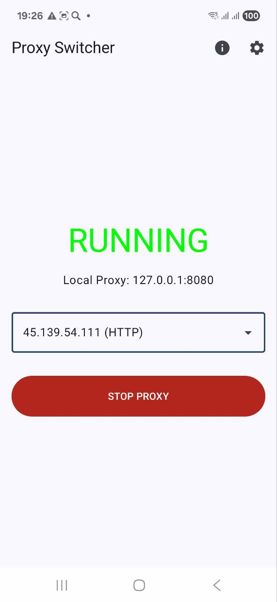
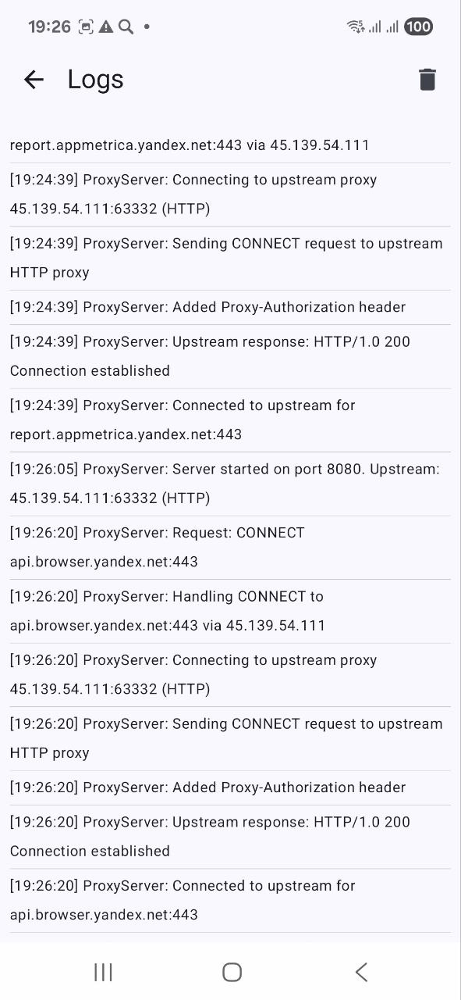
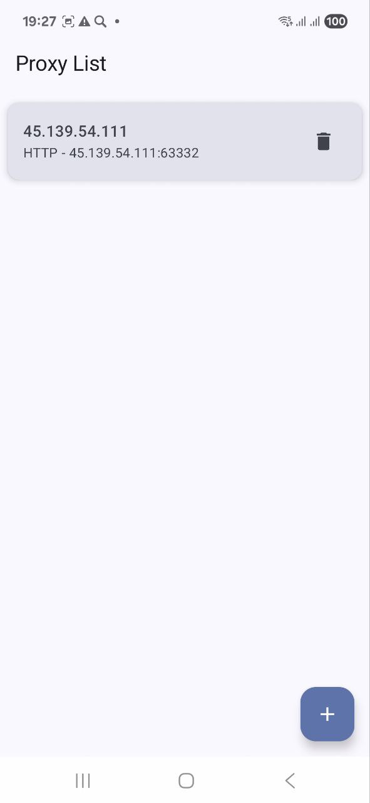
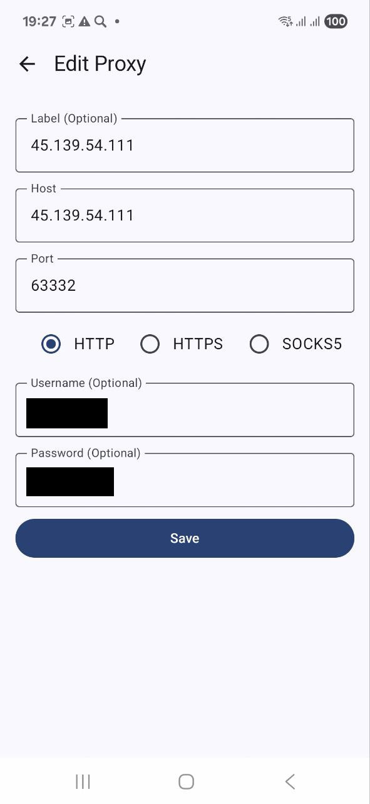

# Proxy Switcher


Android application that runs a local HTTP proxy server on your device and routes all traffic through an upstream proxy (HTTP, HTTPS, or SOCKS5). Automatically manages the system-wide proxy setting so every application on the device uses it — no root required.

## Features

- **Local Proxy Server** — starts an HTTP proxy on port `8080`
- **Upstream protocols** — HTTP, HTTPS (TLS), SOCKS5 with optional username/password auth
- **Auto System Proxy** — sets `127.0.0.1:8080` as the device-wide proxy on START; restores the original on STOP (requires a one-time ADB grant)
- **Race-safe START/STOP** — in-flight start job is cancelled before restoring proxy settings, preventing stale loopback from getting stuck
- **Reliable proxy reset** — restores `http_proxy` to `:0` (not delete) so Chrome/Samsung stacks recognise the clear immediately
- **System Proxy screen** — shows both `Settings.Global` and the actual `LinkProperties` proxy (what Chrome reads). Warns and links to WiFi settings when a per-network proxy is left behind
- **Proxy Management** — add, edit, delete upstream proxies (stored in Room)
- **Logs screen** — built-in real-time log viewer
- **Foreground Service** — proxy keeps running when the app is in the background

## Tech Stack

| Layer | Technology |
|---|---|
| Language | Kotlin |
| UI | Jetpack Compose (Material 3) |
| Architecture | MVVM + Clean Architecture |
| DI | Hilt |
| Database | Room |
| Networking | Custom socket-based proxy core |

## Build & Install

```bash
# Build debug APK
./gradlew assembleDebug

# Build and install on connected device
./gradlew installDebug
# or
make install
```

### One-time ADB permission grant

Required for automatic system proxy management:

```bash
make adb-grant
# equivalent to:
adb shell pm grant com.hightemp.proxy_switcher android.permission.WRITE_SECURE_SETTINGS
```

> The permission survives app updates but is lost on full uninstall. Run the command again after reinstalling from scratch.

## Usage

1. Open the app → tap the gear icon → add an upstream proxy (host, port, type, auth)
2. Select the proxy in the dropdown on the home screen
3. Tap **START PROXY**

**With `WRITE_SECURE_SETTINGS` granted** — the app automatically sets the system proxy and restores it on STOP. All device traffic (Chrome, system apps, etc.) is routed through the upstream.

**Without the permission** — set the proxy manually once:  
WiFi Settings → long-press active network → Modify → Advanced → Proxy: Manual → `127.0.0.1:8080` → Save

## Makefile Targets

```
make help             # list all targets with descriptions
make build-local      # ./gradlew assembleDebug
make install          # ./gradlew installDebug
make adb-grant        # grant WRITE_SECURE_SETTINGS
make adb-check-proxy  # show all proxy keys: Settings.Global + per-network WiFi
make adb-clear-proxy  # emergency: reset all proxy settings on device
make release          # bump VERSION → gradle → commit → tag → push (triggers CI)
make update-version   # update versionCode/versionName in build.gradle.kts only
make tag              # create and push git tag only
```

## ADB Debugging

### Inspect current proxy state

```bash
make adb-check-proxy
# Shows Settings.Global keys AND the per-network WiFi proxy from dumpsys wifi
```

### Emergency reset

```bash
make adb-clear-proxy
```

This resets all `Settings.Global` proxy keys. It does **not** touch per-network WiFi proxy (see below).

### Diagnosing `ERR_PROXY_CONNECTION_FAILED` after STOP

Android proxy state lives in two separate places:

| Source | Keys | Tool |
|---|---|---|
| `Settings.Global` | `http_proxy`, `global_http_proxy_*`, `global_proxy_pac_url` | `adb shell settings get global http_proxy` |
| Per-network WiFi config | stored in `WifiConfiguration` | `adb shell dumpsys wifi \| grep -i proxy` |

**Common cause on Samsung / Android 10+**: `http_proxy` was not cleared properly (delete leaves residue in some ROMs). The app uses `putString("http_proxy", ":0")` to force a hard reset that Chrome and the Samsung network stack recognise correctly.

**Per-network WiFi proxy**: If the WiFi proxy was set manually before you started using the app's auto-management, it persists independently of `Settings.Global`. On Android 10+ non-system apps cannot modify it programmatically.

**Recovery steps**:

1. Run `make adb-check-proxy` — look for `HTTP proxy: [127.0.0.1] 8080` in the WiFi section
2. Open the **System Proxy** screen in the app (NetworkCheck icon on the home screen). If the per-network proxy is stale, a red warning and **Open WiFi Settings** button appear
3. In WiFi Settings: long-press active network → Modify → Advanced → Proxy → **None** → Save
4. Force-kill Chrome: `adb shell am force-stop com.android.chrome`

After step 3 the issue will not recur as long as the app manages the system proxy automatically.

### Stream proxy logs

```bash
adb logcat -s ProxyServer:D ProxyService:D
```

## Performance Characteristics

The proxy core (`ProxyServer.kt`) is tuned for mobile network conditions:

- `TCP_NODELAY = true` — removes Nagle-algorithm delays (40–200 ms) on interactive/multiplexed traffic
- `SO_RCVBUF / SO_SNDBUF = 256 KB` — larger kernel ring buffers reduce back-pressure during burst traffic (video, images)
- 64 KB tunnel buffer — 16× larger than the original 4 KB, fewer `read/write` iterations on large transfers
- No `flush()` in the tunnel hot path — `SocketOutputStream.flush()` is a no-op in JVM but adds call overhead in a tight loop
- Bulk `readNBytes` — eliminates per-byte syscalls during SOCKS5 handshake
- `BufferedInputStream` for SOCKS5 handshake — batches small reads
- `ServerSocket` backlog = 256 — handles burst connection arrivals without OS dropping them
- 16 KB initial request buffer — avoids truncating large HTTP headers (Cookie, Authorization)

## Architecture Notes

```
app/src/main/java/com/hightemp/proxy_switcher/
├── data/local/            # Room DB: AppDatabase, ProxyDao, ProxyEntity (ProxyType enum)
├── data/repository/       # ProxyRepository — thin DAO wrapper
├── di/                    # Hilt modules (DatabaseModule)
├── proxy/                 # ProxyServer.kt — socket-based HTTP/HTTPS/SOCKS5 proxy core
├── service/               # ProxyService.kt — foreground service, port 8080
├── ui/
│   ├── screens/           # HomeScreen, ProxyListScreen, AddEditProxyScreen, LogsScreen, SystemProxyScreen
│   ├── theme/             # Material 3 tokens
│   └── viewmodel/         # ProxyViewModel (@HiltViewModel)
└── utils/                 # AppLogger — singleton StateFlow<List<String>>, capped at 1000 entries
```

Key `ProxyService` behaviours:
- Saves all proxy keys to `SharedPreferences` on START, restores on STOP
- Skips stale loopback values (`127.0.0.1:8080`) when saving originals — prevents a previous crash from polluting the restore target
- Resets `http_proxy` to `:0` instead of deleting — reliable on Samsung/Chrome (SKILL: android-proxy-recovery)
- Per-network WiFi proxy modified only on Android < 10 (API 29) — restricted for non-system apps on newer versions

## Screenshots

    


